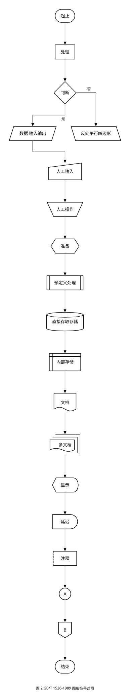
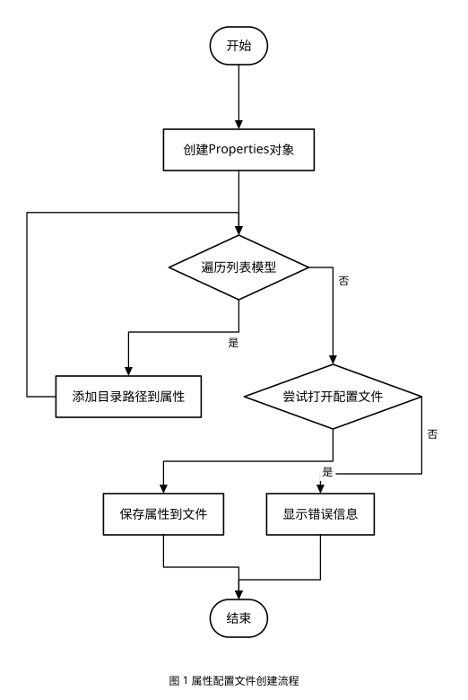

# dsh-plugin-mermaid-gb-svg

[](https://www.npmjs.com/package/dsh-plugin-mermaid-gb-svg)
[](LICENSE)
[](https://github.com/topics/dsh-plugin)
[](https://openstd.samr.gov.cn/bzgk/std/newGbInfo?hcno=D19A1DF7C8A8058E26EC8DFE9EBD001B)

A [DeepSeek Harness](https://github.com/deepseek-ai/deepseek-harness) plugin that turns **Mermaid
flowcharts** into **GB/T 1526-1989** compliant **SVG** (the Chinese national standard, identical to
ISO 5807:1985), and exposes it to the model as one tool.

## Preview

| GB/T 1526-1989 symbol chart | Generated flowchart |
|---|---|
|  |  |

Both SVGs are produced by this tool — the source `.mmd` files are in [`examples/`](examples/).

## Install

```bash
# 1) install into a profile (web shown here)
dsh plugin --profile web add dsh-plugin-mermaid-gb-svg

# 2) make the loader load it — append to $DSH_HOME/profiles/web/cordis.patch.yml
```

```yaml
- insert:
    - id: mermaid-gb-svg
      name: dsh-plugin-mermaid-gb-svg
      # config:
      #   fontSize: 14
      #   paper: none
```

For local development point at the source directory instead:
`dsh plugin --profile web add /path/to/dsh-plugin-mermaid-gb-svg`.

## Tool: `mermaid_to_gb_svg`

| Parameter | Type | Description |
|---|---|---|
| `out` | string, **required** | Output path. Ending in `.svg` = file name (multi-diagram gets `-1/-2`), otherwise output dir/prefix |
| `source` | string | Mermaid source (mutually exclusive with `path`) |
| `path` | string | Input `.mmd`/`.mermaid`, or `.md` containing ` ```mermaid ` blocks (all blocks extracted; nearest heading above becomes the caption) |
| `title` | string | Figure caption |
| `dir` | `td`\|`lr`\|`bt`\|`rl` | Force flow direction |
| `paper` | `none`\|`auto`\|`a4`\|`a4l`\|`a3`\|`a3l` | Sheet size; `none` (default) emits one large SVG, others paginate when the drawing does not fit |
| `font_size` | integer | Body font size in px (14 ≈ 10.5pt) |
| `font_tu` | boolean | Use technical-drawing font (GB/T 14691 FangSong) |
| `caption` | boolean | Draw the caption (default true) |

Returns `files`, `diagrams`, `pages`, `summary`, `warnings`.

## GB/T 1526-1989 symbols

| Symbol | Meaning | Mermaid syntax |
|---|---|---|
| rounded rectangle | terminal (start/end) | `A([x])` `A((x))` `A(x)` |
| rectangle | process | `A[x]` |
| diamond | decision | `A{x}` |
| parallelogram | data (input/output) | `A[/x/]` `A[\x\]` |
| hexagon | preparation | `A{{x}}` |
| double-sided rectangle | predefined process | `A[[x]]` |
| cylinder | direct access storage | `A[(x)]` |
| trapezoid | manual operation | `A{/x/}` |
| sloped-top quad | manual input | `A{\x\}` |
| square bracket | annotation | `A>x]` |
| circle | connector (on page) | `A@{ shape: connector, label: "A" }` |
| **pentagon** | **off-page connector** | `A@{ shape: off-page, label: "B" }` |
| — | document / multi-document | `A@{ shape: doc, label: "report" }` / `docs` |
| — | display / delay | `A@{ shape: display, label: "display" }` / `delay` |
| — | internal storage | `A@{ shape: internal-storage, label: "storage" }` |

`shape` accepts both Mermaid v11 names and Chinese names (处理/起止/判断/数据/准备/预定义处理/
直接存取存储/人工输入/人工操作/文档/多文档/显示/延迟/内部存储/注释/连接符/换页连接符).

## Drawing conventions

- Flow runs **left-to-right or top-to-bottom**; flowlines are orthogonal with solid arrowheads.
- Decision branches: **`是` leaves the bottom vertex downward**, **`否` leaves the right vertex**
  (going right first, then turning).
- Every incoming flowline enters a symbol **vertically at its top centre**.
- **At most 3 bends per flowline** — routes are tried in order 0→1→2→3 bends and the first one that
  does not cross a symbol wins.
- Geometry is self-checked after generation (overlaps, flowlines through symbols) and reported in
  `warnings`.

## Pagination (optional)

With `paper: a4` (or `a3`/`auto`), a drawing that does not fit is split:

- cuts fall in the **gaps between layers** (and between columns of symbols), never through a symbol;
- each sheet is sized in real millimetres (`width="210mm" height="297mm"`) with a frame, a binding
  margin and a `(page n/N)` caption;
- each broken flowline gets an **off-page connector (pentagon)** pointing along the flow, and the
  connector sits at the same place with the same label on both sheets.

## Configuration

| Key | Default | Meaning |
|---|---|---|
| `font` | `SimSun, '宋体', 'Microsoft YaHei', sans-serif` | Font family |
| `fontSize` | `14` | Body font size (px) |
| `stroke` | `1.6` | Line width |
| `paper` | `none` | Default sheet size |

## Sandbox

Writes go through the Harness `ctx.fs` seam with the session's sandbox policy, and support the same
one-shot `sandbox_permissions` + `justification` escalation retry as the built-in `write` tool.

## Development

```bash
npm test        # test/engine.test.mjs + test/plugin.test.mjs
```

`lib/engine.js` is **generated** from the CLI version (`tools/mermaid2gb-svg.js`) so both stay in
sync; edit the CLI and regenerate rather than editing the engine directly.

## Feedback

Feedback is what decides what gets built next — especially **standard-compliance corrections**, since
GB/T 1526-1989 has details that are easy to get subtly wrong.

| Channel | Use it for |
|---|---|
| [Issues](https://github.com/sandyyst/dsh-plugin-mermaid-gb-svg/issues/new/choose) | Bugs, **symbol corrections** (there is a dedicated template — please cite the clause/figure), feature requests |
| [Discussions](https://github.com/sandyyst/dsh-plugin-mermaid-gb-svg/discussions) | Usage questions, layout/typography opinions, open-ended ideas |
| sandyyst@hotmail.com | Anything you would rather not post publicly |

**When reporting a problem, attach the Mermaid source.** A one-line description plus the `.mmd` is
usually enough to reproduce it — the generated diagram, the tool's `warnings` array, and your plugin
version help too.

If the tool reports geometry warnings, the output already carries the link to the issue tracker —
that is the moment the report is most useful.

## License

MIT
